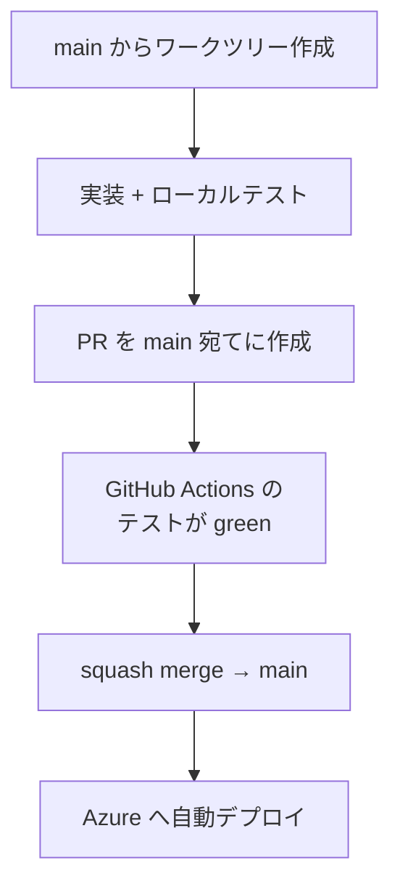
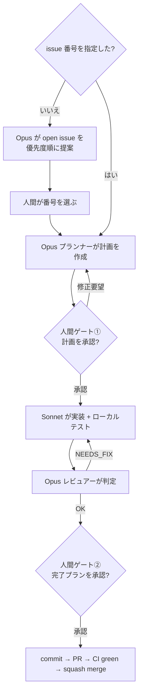

# 開発プロセス

## このページの狙い

stock-monitor は個人開発のプロジェクトですが、「10年動き続ける」ことを前提にしているぶん、開発の進め方にも一貫した型があります。このページでは、**コードがどう書かれ、テストされ、本番に届くのか**を、外から見て分かるように通して説明します。

個人開発でありながら、実装の多くを **AI エージェント（Claude）** が担っているのが特徴です。そのため「人間とエージェントの役割分担」が随所に組み込まれています。

システムの思想や機能については、[アプリ解説](./overview)・[機能ガイド](./features)をご覧ください。このページは開発の進め方に興味がある方を想定しています。

**対応バージョン**: {{ $frontmatter.version }}

## 全体の流れ — トランクベース運用

ブランチは `main` 一本だけ。長生きする開発ブランチは作りません。これを**トランクベース運用**と呼びます。

エージェントは `main` から作業用のワークツリー（作業コピー）を切り出し、そこで実装してから PR（プルリクエスト）で `main` に戻します。マージは squash merge（変更を1コミットにまとめる）で、履歴をきれいに保ちます。

マージされると Azure へ自動でデプロイされ、そのとき**「今動いているのはどのコミットか」を示す印（Git の短縮SHA）が Azure の設定に書き込まれます**。起動ログにも `(sha=...)` として出るので、「本番で動いているコードの正体」を常に1対1で追えます。日々の細かい修正はバージョンを据え置いたまま `main` に流していきます。

## テスト — 3本立てと責任分界

テストは3つのスクリプトに分かれています。大事なのは、**それぞれ役割（責任）がはっきり分かれている**こと。1つのテストに何でも詰め込まず、目的別に切り分けています。

| テスト | 何を確かめる | 外部通信 | API キー |
| --- | --- | --- | --- |
| `test_unit.py` | ビジネスロジックの正確性 | **禁止**（すべてモックで代替） | 不要 |
| `test_local.py` | 外部サービスとつながるか | **必須**（疎通確認が目的） | 必要 |
| `test_backtest.py` | 下落判定ロジックの回帰確認 | `--llm` 指定時のみ | `--llm` 時のみ |

考え方はこうです——

- **`test_unit.py`** は、外部の株価 API や LLM に一切つながず、すべてを「モック（偽物）」で置き換えて高速に回します。狙いは「ロジックそのものが正しいか」。誰のネットワーク状態にも左右されず、いつでも同じ結果が出ます。
- **`test_local.py`** は逆に、本物の外部サービス（株価・ニュース・LLM・Discord）に**実際につないで**疎通を確認します。`.env` に認証情報が要ります。狙いは「外の世界とちゃんと握手できるか」。
- **`test_backtest.py`** は、過去の相場シナリオ（fixture）を使って「下落判定ロジックが期待どおりに分類するか」を回帰チェックします。ロジックをいじった後で、以前正しく判定できていたケースが壊れていないかを守ります。

### false green（嘘の合格）を防ぐ仕掛け

地味ですが重要な工夫があります。3つのランナーはいずれも、**テストが0件しか実行されなかったら異常終了**するようになっています。さらに CI 側でも「PASS が1件以上あること」を別途チェックします。これにより、「テストが実は1つも走っていないのに green になっていた」という最悪の見落としを二重に防いでいます。

### モックの徹底というルール

`test_unit.py` には「外部通信・ファイルI/O が発生する関数はすべてモックする」という厳格なルールがあります。これを守るため、ランナーは実通信する5つの関数に**番兵（sentinel）**を仕込み、モックし忘れて本物を呼ぼうとした瞬間にエラーで爆発させます。「うっかり本番 API を叩いてしまう」事故を、テスト設計の段階で物理的に潰しています。

::: tip 番兵パターンの利点
モックし忘れを「後から気づく（テスト後のデバッグ）」ではなく「その瞬間に爆発させる（テスト実行時点でエラー）」ことで、問題の発見と修正コストを最小化しています。この設計により `test_unit.py` は「すべての外部依存が完全にモックされていること」を自己証明するテストになっています。
:::

## CI/CD — GitHub Actions

### テストワークフロー

`main` への PR をきっかけに、GitHub Actions が `test_unit.py` と `test_backtest.py` を自動で回します。流れは「チェックアウト → Python セットアップ → 依存インストール → テスト実行 → （失敗時のみ）Discord 通知」。

失敗したときは、ブランチ名・コミットの情報・実行ログへのリンクを Discord に飛ばします。このとき、コミットメッセージの特殊文字や改行で通知が壊れないよう、`jq` を使って JSON を安全に組み立てています（シェルに直接埋め込むと壊れるため）。

### あえて「ハードブロックしない」という設計判断

ここは説明が要ります。普通のチームなら「テストが赤ならマージ禁止」というブランチ保護ルールを掛けます。stock-monitor は**あえてそれを掛けていません**。CI が赤でも、物理的にはマージできます。

これは[10年続ける持続性](./overview#shiso-6)（個人開発としての持続可能性）に基づく意図的な選択です。個人開発では、緊急時に人間の判断で押し通せる自由を残しておくほうが、硬すぎるルールに縛られて止まるより健全だ、という割り切りです。代わりに「テスト合否はちゃんと見える」「失敗すれば Discord に飛ぶ」という形で、強制ではなく**可視化**で品質を担保します。

### デプロイワークフロー

`main` への push をきっかけに、Azure Functions へ自動デプロイされます。認証は OIDC（シークレットを長期保持しない方式）。同時に複数のデプロイが走らないよう排他制御も掛かっています。デプロイ後にコミットの短縮SHA が Azure 設定に刻まれ、本番の正体追跡につながります。

## リリース — SemVer

バージョンは `vX.Y.Z` の形式（セマンティックバージョニング）で、`stock/__init__.py` の記述と Git タグで管理します。

| 種類 | 上げるとき |
| --- | --- |
| パッチ（Z） | バグ修正 |
| マイナー（Y） | 後方互換のある機能追加 |
| メジャー（X） | 破壊的変更 |

日々の細かい修正はバージョンを据え置いたまま流し、**意味のある機能の区切りや大きな変更のときだけ**手動でバージョンを上げます。バージョン更新・タグ付け・Discord へのリリース通知という一連の手順は、後述の `/release` スキルがガイドします。

## マルチエージェント開発フロー（agent-resolve）

stock-monitor のいちばん特徴的なところが、**複数の AI エージェントを役割分担させて GitHub の課題（issue）を解決する**仕組みです。`/agent-resolve` という開発スキルがこれを担います。

中核は「計画する人・書く人・チェックする人」の3役です。これに、issue を選ぶ前段の**前さばき**が1つ加わり、それぞれ違うモデルと役割で連携します。

| エージェント | モデル | 役割 | できないこと |
| --- | --- | --- | --- |
| 優先順位づけ役 | Opus | open な issue を優先度順に並べ、どれから着手するか提案する（issue 番号を指定しなかったときだけ動く前さばき） | コードの編集は不可 |
| プランナー | Opus | issue を分析し、実装計画を立てる | コードの編集は不可（計画専念） |
| 実装担当 | Sonnet | 計画どおりに実装し、テストで検証する | commit / push は不可 |
| レビュアー | Opus | 不変条件・計画との整合・ドキュメント同期を確認し、マージ可否を判定 | コードの編集は不可（判定専念） |

肝になるのは中核の3役です。役割を分け、それぞれに「できないこと」を課すことで、計画する人・書く人・チェックする人を分離し、一人のエージェントが暴走して計画から逸れるのを防ぎます。優先順位づけ役は、issue 番号が決まっていないときに「まず何をやるか」を整理する前さばきという位置づけです。

### 2つの人間ゲート

この流れには、人間が必ず承認を挟む関所が**2か所**あります。これは[最終判断は人間](./overview#shiso-5)（最終判断は常に人間）を、開発プロセスにそのまま写し取ったものです。

なお、**issue 番号を指定せずに `/agent-resolve` を呼ぶと、その手前に「優先順位づけ」のひと工程**が入ります。Opus が open な issue を優先度順に並べ、「どれからやりますか?」と人間に提案する前さばきです。ここで人間が番号を選ぶ操作は承認ゲートには数えず、あくまで着手対象を決めるための整理にあたります。番号を最初から指定した場合は、この工程を飛ばしていきなり計画づくりから始まります。

- **人間ゲート①（計画承認）** — 実装に入る前に、人間が計画そのものを承認します。納得いかなければ何度でも修正させます。
- **人間ゲート②（完了承認）** — 実装とレビューが終わった後、「コミット → PR 作成 → CI 通過待ち → マージ → 後片付け」という最終手順を、人間が一括承認してから実行します。

レビュアーが「直しが必要（NEEDS_FIX）」と判定したら実装担当に差し戻し、それが2回続いたら計画自体を見直すために人間に相談する、というループも組み込まれています。逆に、指摘が**些細なもの（nit）だけで本質的な問題（blocking）がなければ、OK 扱いでそのまま先へ**進みます。AI に任せきりにせず、要所要所で人間が舵を握り続ける設計です。

## プランレビュー（標準モード）

agent-resolve とは別に、通常のプランモードで立てた計画も、ユーザー承認を求める前に必ず専用の Opus レビュアー（`plan-reviewer`）にレビューさせる、という無条件のゲートがあります。軽微な計画も例外にしません。観点は、不変条件・思想への適合、要件の過不足、ドキュメントの責務分担、テスト方針、既存資産の再利用機会、副作用リスクなど。

## 開発支援スキル一覧

`.claude/skills/` 配下のスキルを、スラッシュコマンド（`/スキル名`）で起動します。日々の開発・運用・監査を支える道具箱です。

| スキル | 用途 |
| --- | --- |
| `agent-resolve` | マルチエージェント構成で GitHub issue を解決する |
| `release` | バージョンを確定して更新・タグ付け・Discord 通知まで行う |
| `file-issue` | 議論で出た課題を構造化して GitHub issue に起票する |
| `check-consistency` | ドキュメント・コード・テスト・設定の整合性をチェックし、ドリフト（ずれ）を報告する |
| `check-azure-logs` | Azure のログを点検し、動作上・設計上の問題を洗い出す（監査） |
| `download-blob-logs` | Azure Blob の JSONL ログを期間指定でダウンロードして整理する |
| `lint-markdown` | リポジトリ内の Markdown を整形・是正する |
| `housekeep` | エージェントのメタデータ（メモリ・worktree 等）を棚卸しして清掃する |

`check-azure-logs` / `download-blob-logs` を使ってログを実際にどう分析し、閾値やプロンプトを締めていくかは、[運用・チューニングガイド](./operations)で解説しています。

---

まとめると、stock-monitor の開発プロセスは「**トランクベースでシンプルに、テストは目的別に切り分け、CI は強制ではなく可視化で支え、実装は AI エージェントに分担させつつ要所で人間が承認する**」という形に落ち着いています。アプリ本体の思想（罠を避ける・最終判断は人間・10年続ける）が、そのまま開発のやり方にも反映されているのが、このプロジェクトらしさです。
