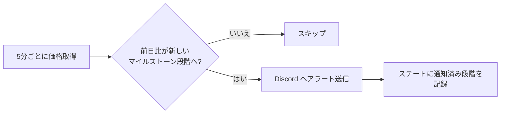
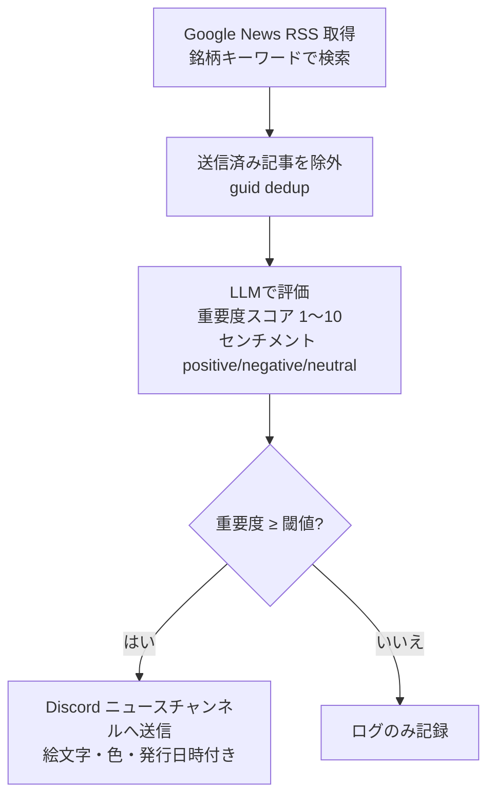
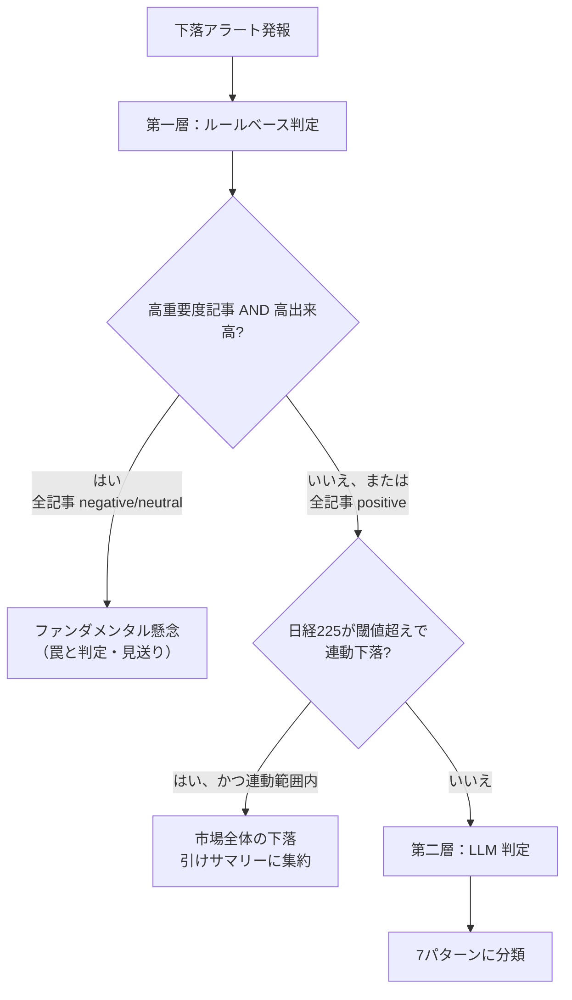
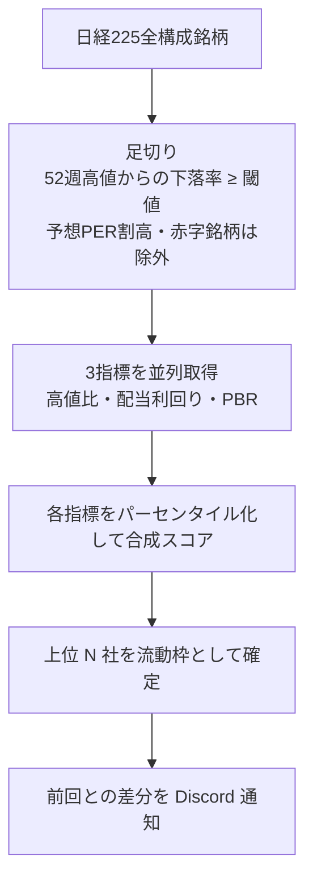

# 機能ガイド

## このページの狙い

[アプリ解説](./overview)では「なぜこういう発想なのか」という思想と仕組みの全体像を説明しました。このページでは視点を変えて、**個々の機能が具体的に何をやっているか**を順番に見ていきます。「あの通知はどこから来るのか」「あの判定はどういう仕組みで動くのか」という疑問に答えるページです。

stock-monitor の基本的な動作はわかっているが、各機能の中身をもう少し詳しく知りたい、という方を想定しています。まだ全体像をつかんでいない方は、先に[アプリ解説](./overview)をご覧ください。

**対応バージョン**: {{ $frontmatter.version }}

## 株価監視——マイルストーン型の段階アラート

5分ごとに yfinance から現在価格と前日終値を取得し、**前日比（%）がマイルストーンの段階を超えるたびに追加アラートを送信**します。

マイルストーンの単位は銘柄ごとの `threshold_pct`（閾値）です。閾値が `3.0%` の銘柄なら、`-3%` で1段目のアラート、さらに下落が進んで `-6%` に達したら2段目を追加送信する、という具合です。上昇側も同様に動きます。

（下図）ステートに通知済み段階を記録し、同じ段階への再通知を防ぐ仕組み。



「一日に何度も同じアラートが来る」のを防ぐため、ステートに**当日の最高通知済み段階**を記録しています。段階が上がったときだけ追加通知し、横ばいや小反発では再通知しません。日付が変わると自動リセットされ、翌営業日はゼロから始まります。

### glitch ガード

yfinance が誤ったデータを返すことが稀にあります（実際に「前日比 +41%」という異常値が観測されています）。これを誤通知につなげないよう、2段階のサニティチェックが入っています。

| チェック | 発動条件 |
| --- | --- |
| 日次キャップ | 前日比の絶対値が 30% 以上（値幅制限を超えるため必ず異常） |
| サイクル間キャップ | 前回取得価格との差が 15% 以上（場中の一瞬の誤 print を検知） |

日次キャップは即座に抑制しますが、サイクル間キャップは「数サイクル連続して同じ水準が続いたら本物の動きとして受け入れる」という脱出機構を持っています（誤 print は次のサイクルで元値に戻るため、連続しない）。

---

## ニュース取得と重要度判定

株価が動いているかどうかに関わらず、Google News RSS から新着ニュースを取得し、LLM で採点します。**株価アラートとは独立した処理**です。



### スコアとセンチメント

LLM は1回の評価で2つの値を返します。

- **重要度スコア（1〜10）** — その記事が株価に影響を与えうる重大さの度合い。`importance_threshold` 以上のスコアの記事だけ Discord に通知されます。
- **センチメント（positive / negative / neutral）** — 株価への影響方向。Discord embed の絵文字（📈/📉/➡️）と色（緑/赤/黄）に反映されます。

### ニュースの重複防止

送信済みの記事 GUID をステートに蓄積し、一度通知した記事は再評価しません。ただし「通知 dedup（送信済みリング）」とは別に、**営業日ベースのローリングキャッシュ**（デフォルト1営業日分）も持っています。こちらは下落パターン分析に文脈を供給するためのもので、通知済みかどうかとは独立して前後のサイクルに記事内容を渡し続けます。経過時間ではなく営業日で数えるので、金曜に評価した記事は土日を挟んで翌月曜の分析まで保持されます。

::: tip センチメントの活用例
朝に「📉 重要度8 / negative」のニュースが来て、その後すぐ株価が急落したとします。下落パターン分析が走るとき、このニュースは「高重要度＋ネガティブ＋高出来高」という文脈として判定に使われます。価格アラートとニュース評価は独立して動きますが、下落判定の場面でつながります。
:::

### 非営業日のニュース専用モード {#news-only-mode}

平日は5分ごとに価格監視・ニュース評価・下落分析とすべての処理が動きますが、**土日・祝日（年末年始を除く）はニュース専用モード**に切り替わります。専用タイマーが **1日3回（08:00 / 12:00 / 20:00 JST）** 起動し、朝・昼・夜のスロットごとに最大1回ずつニュースを取得・評価します。

このモードで動くのは、ニュース取得と重要度評価・文脈キャッシュの更新・テーゼ崩壊監視・ニュース通知の4つだけです。価格監視・下落パターン分析・引けサマリー・流動枠スクリーニングは平日のみ動作します。

**テーゼ崩壊の監視は休日でも止まりません。** リリース発表や行政の通達は土日でも出ることがあり、保有テーゼを揺るがす材料は素早くキャッチして即時通知します。また、休日に拾った記事は上述の営業日ベースキャッシュに蓄積されるので、翌月曜の下落分析にしっかり文脈として引き継がれます。

---

## 下落パターン分析——「罠か買い場か」の自動判別 {#drop-analysis}

株価下落アラートが発報されたときだけ実行される、このシステムの核心機能です。**ルールベース（第一層）と LLM（第二層）の二層**で「この下落は罠か、それとも買い場の歪みか」を判定します。

### 7つのパターン

下落は次の7パターンのいずれかに分類されます。

| パターン | 意味 | 買い場? |
| --- | --- | --- |
| **市場全体の下落** | 日経225と連動した連れ安。個別要因なし | ✗ |
| **ファンダメンタル懸念** | 業績悪化・下方修正など個社に固有の悪材料あり | ✗ |
| **資金ローテーション** | セクター/テーマ全体からの資金流出。個社の業績とは無関係 | ✓（保留中）|
| **注目度不足** | 出来高が薄く買い手不在。需給不足による自然な値動き | ✓ |
| **出尽くし** | 好材料（好決算等）が材料消化されて反落 | ✓ |
| **過剰連れ安** | 市場下落局面で個社の下落が市場を大きく超過 | ✓ |
| **ノイズ** | 出来高が薄く、実体的な売り圧力とは見なせない | ✗ |

上記いずれにも当てはまらない・判断材料が不足する場合は「不明」として見送り扱いになります。

::: warning 資金ローテーションの暫定ステータス
「資金ローテーション」は設計上は買い場候補のパターンですが、**現在は観測蓄積フェーズのため Discord への昇格通知は暫定的に保留中**です。判定ログには記録されますが、Discord 通知では「不明（見送り）」として扱われます。十分なデータが蓄積された段階で解除される予定です（恒久的に採用しないわけではありません）。
:::

現在有効な買い場候補パターンは「注目度不足」「出尽くし」「過剰連れ安」の3つです。残りは見送りまたは保留です。

### 判定の流れ



**ルールベースで確定できない場合のみ LLM に委譲する**設計で、判断コストを絞っています。

### 出力ガード {#output-guards}

LLM の判定結果にも、さらに3つの安全弁が掛かります。

| ガード | 働き |
| --- | --- |
| **クラッシュガード** | 閾値の2〜2.5倍超の大暴落ゾーンで、好材料カタリストが見当たらない場合は「不明（見送り）」に降格 |
| **内生キル** | 原油が累積で下落しており、かつ石油業種銘柄の場合は「不明（見送り）」に降格（石油会社にとって原油安は自社損益に直結する正当な下落であり、買い場ではない＝"内生的"な下落を"キル"する、の意） |
| **資金ローテーション保留** | 上記の暫定ステータスに基づき、判定ログには残るが Discord 通知では「不明」として扱う |

判断できない・立証できない場合は、すべて「見送り」側に倒します（[罠回避の原則](./overview#shiso-3)：立証責任は買い場側に）。

### 通知スタイル

下落アラートが出た場合、判定結果や銘柄種別にかかわらず、必ず Discord に分析結果を送信します。スタイルは3種類です。

| スタイル | 条件 |
| --- | --- |
| 🎯 買い場候補 | [固定枠](./overview#watchlists)かつ買い場と判定、財務懸念なし |
| 🔎 要確認 | 固定枠で財務懸念あり、または流動枠で買い場と判定（[堀](./overview#shiso-2)が未検証） |
| 📋 下落パターン | 罠と判定（どの銘柄枠でも） |

---

## テーゼ崩壊監視——出口のシグナル

「安く仕込む（買い）」と対になる「**仕込んだ理由が崩れたら撤退を支援する（出口）**」機能です。

固定枠の銘柄には `thesis`（投資テーゼ）を記述できます。テーゼ崩壊監視は、このテーゼを毎日ニュースと照合し、「堀が構造的に崩れた」と判断したときだけ Discord に通知します。

### 株価と独立して動く

ここが重要な点です。**テーゼ崩壊監視は株価変動をトリガーにしません**。株価が全く動いていない日でも、重大なニュースがあればチェックが走ります。

トリガーの条件：
- 固定枠の銘柄（流動枠は堀が未検証のため対象外）
- `thesis` が設定されている
- 重要度スコア7以上 かつ sentiment が negative / neutral の新着記事が1件以上

これが揃うと LLM が thesis 全文と記事内容を照合し、3段階の verdict を返します。

| verdict | 意味 | 通知 |
| --- | --- | --- |
| 健全 | ニュースはテーゼの堀に影響しない | しない |
| 要監視 | 懸念はあるが構造的毀損の証拠はまだない | しない |
| テーゼ崩壊の疑い | 堀が構造的に崩れた明確な証拠がある | 即時通知 ⚠️ |

「健全」「要監視」は Discord に通知せず、ログにのみ記録します。これは認知負荷を下げるための設計で、「テーゼが崩れた」という確実なシグナルだけを人間に届けます。

::: tip テーゼの書き方が判定の質を決める
thesis を「強みの宣言」で止めると、LLM が照合する「崩壊の条件」が曖昧になります。崩壊トリガーを明示しておくと、LLM はまず「ニュースがそのトリガーに該当するか」を優先して照合します。たとえば「AIデータセンター向け半導体テスト需要が縮小した場合」「国内での独占シェアが競合参入によって20%以下に落ちた場合」といった形で、崩壊の条件を具体的に書いておくほど精度が上がります。
:::

---

## 流動枠スクリーニング——日次の自動候補選定 {#floating-screening}

固定枠は人間が手で選んだ本命銘柄ですが、流動枠はシステムが**日経225構成銘柄（225社）から自動で割安候補を選び出す**枠です。1日1回だけ実行され、当日の監視リストに自動で加わります。

### 選定の仕組み

3つの数値指標で「割安スコア」を算出し、上位銘柄（デフォルト最大10社程度）を選びます。



定性的な「この企業はいい会社か」という判断は一切持ち込まず、純粋に数値だけで機械的に選定します。「広く拾う浅い枠」として、固定枠（深い枠）を補う役割です。

### 入れ替え通知と成長性スコア

前回との銘柄の入れ替えがあった場合は Discord に通知します。スクリーニング実行のたびに、現在の流動枠全量の一覧も送信されます。

一覧には**成長性スコア（1〜10）** という LLM による補足注記も表示されます。これは「この銘柄が不可逆なマクロトレンドの恩恵をどれだけ受けているか」という定性評価ですが、**選定の当落には一切影響しません**。あくまで参考情報として人間が判断するための注記です。

---

## 引けサマリーと指数アラート

### 引けサマリー

毎営業日の引け後5分（15:35〜15:40 JST）に、**日経225の終値と全監視銘柄の終値・前日比を1つのメッセージにまとめて送信**します。

```
📊 2026年6月22日 引けサマリー

📈 日経225　38,500円　+0.85%

📈 三菱重工業（7011.T）　1,250円　+4.17%
📉 三菱電機（6503.T）　2,100円　-2.33%
...

🌧️ 本日の地合い連れ安（日経連動・個別要因なし）: フジクラ、○○
```

末尾に「地合い連れ安」の一覧が出るのがポイントです。「市場全体の下落」パターンに分類された銘柄は、場中に個別で通知せず引けサマリーに集約します。これにより、「連れ安です」という通知が5分ごとに何件も来て埋もれる、という状況を防いでいます。

### 指数アラート

日経225が急落閾値（デフォルト -3.0%）を下回った場合は、**場中に即時 push** します。同じ段階を重複通知しないよう、マイルストーン段階で管理します。

急騰は即時通知せず、引けサマリーの末尾に1行追記します（急騰のたびに通知が来ると認知負荷が増えるため）。

---

## Discord 通知設計——チャンネルで分けて「必ず読む」を守る {#discord-channels}

stock-monitor の通知は2つの Webhook に分かれています。

| チャンネル | 届くもの | 特性 |
| --- | --- | --- |
| **price** | 株価急変アラート、下落パターン分析、買い場候補、テーゼ崩壊の疑い、引けサマリー、流動枠入れ替え | 件数は少ないが重要度が高い。必ず読む |
| **news** | 重要度スコア付きのニュース通知 | 件数が多め。まとめて流し読みできる |

この分割には、Discord のチャンネルごとのミュート設定と組み合わせる意図があります。news チャンネルの通知音は切って、price チャンネルだけ通知音を鳴らすといった使い方が自然にできます。「多くて見落とす」より「絞って必ず読む」を仕組みで支える設計です。

### 通知の重複防止

価格アラートは「当日の最高通知済み段階」で管理。ニュースは「送信済み GUID リング（銘柄ごと最大300件）」で管理。引けサマリーは「当日送信済みフラグ」で管理。それぞれ独立した仕組みで、5分ごとの定期実行でも重複通知が出ないようにしています。

---

ここまでの機能がすべて組み合わさって、「5分ごとに東証銘柄を見張り、歪みを見つけて人間に差し出す」という動作が実現しています。それぞれの機能は独立して設計されていますが、下落パターン分析がニュース評価の結果を使い、引けサマリーが連れ安の集約を担うように、要所でつながっています。

---

開発・テスト・リリースの進め方については、[開発プロセス](./development)をご覧ください。
