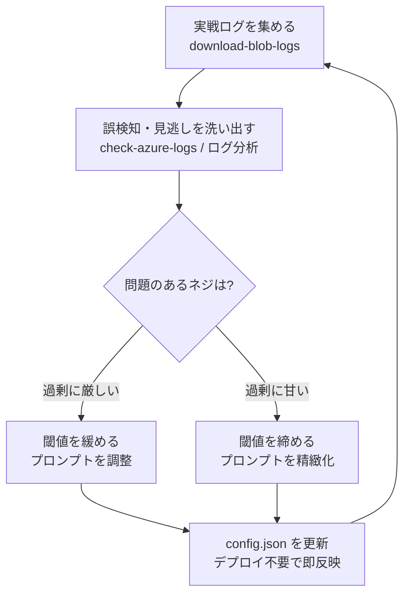

# 運用・チューニングガイド

## このページの狙い

[アプリ解説](./overview)・[機能ガイド](./features)・[開発プロセス](./development)を通して、「なぜ・なにを・どう作るか」は揃っています。このページではその先——**「どう動かし続け、どう精度を上げていくか」**——を解説します。

stock-monitor をある程度使っており、「判定がちょっとおかしい気がする」「見逃しが多い気がする」という感覚を持ち始めた方を想定しています。

**対応バージョン**: {{ $frontmatter.version }}

---

## なぜチューニングし続けるのか

stock-monitor の根底には、「最初から完璧な設計はできない」という前提が置かれています。

相場の暴落パターンは多様で、LLM の判定挙動も事前にすべて読み切ることはできません。だからこそ[思想7](./overview#shiso-7)は完璧主義を捨てることを明言しています——デフォルトを**最も安全な側**（＝機会損失側、「罠かもしれない→見送り」に倒す）に設定し、あらゆる判定の軌跡を構造化ログに残した上で、**実戦データでロジックを後から締めていく**という方向性です。

これは[思想6](./overview#shiso-6)の「素朴でも10年動き続ける」とも対になっています。一発で正解を当てようとするのではなく、観測し・分析し・微修正するサイクルを地道に回すことが、長く精度を保つための設計思想です。

---

## 何を見るのか——観測可能性

チューニングに必要な素材は、すべてログに残っています。

stock-monitor は各処理サイクルで判定の軌跡を **JSONL**（1行1レコードの JSON 形式）として Azure Blob Storage に保存しています。保存されているのは判定の「結果」だけではなく、**どの根拠でその判定になったか**という理由も含まれます。

記録される主なカテゴリはこういったものです:

- **価格アラートの履歴** — どの銘柄が何 % の下落でアラートを出したか
- **スクリーニングの経緯** — 何社から何社に絞り込まれたか、なぜその銘柄が選ばれたか
- **ニュース評価の記録** — 重要度スコアとセンチメントの判定根拠
- **下落パターン分析のトレース** — どのパターンに分類されたか、なぜ「見送り」に倒したか（`llm_trace` が有効な場合は LLM への入出力も記録）

「こういう粒度で全判定を記録している」ことが、チューニングを可能にする基盤です。ログがなければ「なんとなく精度が悪い」で終わってしまうところを、「**どのネジが原因か**」まで追えるようになります。

---

## どう回すのか——チューニングのループ

実際の運用は、次の4ステップのループです。

（下図）実戦ログを起点に、誤検知・見逃しを分析し、設定を調整して、また観測に戻るサイクル。

### ログを手元に集める

`download-blob-logs` スキルで Azure Blob の JSONL ログを期間指定でローカルにダウンロードします。「先週1週間の全 kind」「先月の price_alert だけ」といった指定ができます。

### 誤検知・見逃しを洗い出す

手元に集めたログを `check-azure-logs` スキルで点検します。このスキルは動作面（例外・警告・発火頻度の欠測）と設計面（[思想7](./overview#shiso-7)の観点から「このネジを締めると精度が上がる」という示唆を導出）の両面で分析を行います。

::: tip check-azure-logs と思想7
このスキルの実行そのものが思想7の実践です。「どの閾値の過剰な厳しさが機会損失を生んでいるか」「どのプロンプトが誤判定を引き起こしているか」を、人間が読めるレポートとして出力します。報告するだけで、設定の変更はしません——最終判断は常に人間（[思想5](./overview#shiso-5)）です。
:::

### 設定を更新する

問題のあるネジを特定したら、`config.json` を直接編集します。**設定変更はデプロイ不要で即反映**されます（Azure Functions が起動するたびに config を読み直す設計のため、コードの再デプロイなしに翌サイクルから新しい設定で動きます）。

これは[思想6](./overview#shiso-6)の「低認知負荷・低コスト」を体現した設計です。設定変更のたびにデプロイパイプラインを走らせる手間がかからないため、細かいチューニングを気軽に試せます。

---

## どのネジを回すのか

設定で調整できる主な要素と、「それを回すと何が変わるか」の対応関係です。

### 下落パターン分析の閾値

[下落パターン分析](./features#drop-analysis)では、「どの程度の下落からルールベースの判定を適用するか」「LLM に委譲するかどうかの境界」を閾値で調整します。

- **締める方向**: 買い場と判定されにくくなります。誤検知（本当は罠なのに買い場と判定）が減りますが、見逃し（本当の買い場を素通り）が増えます。
- **緩める方向**: 買い場候補が増えます。チャンスを逃しにくくなりますが、精度が落ちて通知ノイズが増えます。

デフォルトは意図的に「締め側」に設定されています（[思想7](./overview#shiso-7)の「デフォルトを機会損失側に」）。

### 出力ガード

[出力ガード](./features#output-guards)はLLMの判定結果に掛かる安全弁です（クラッシュガード・内生キルなど）。

- **クラッシュガードを強くする**: 大暴落時に買い場と判定されにくくなります。底値を拾いにいく局面でも「不明（見送り）」に降格されやすくなります。
- **クラッシュガードを弱める**: 大暴落局面での買い場候補が増えます。ただし「本当の業績崩壊を掴む」リスクも上がります。

クラッシュガードは「下落幅が株価変動閾値の何倍を超えたら発動するか」という倍率で設定します。

### 流動枠スクリーニングの重み

[流動枠スクリーニング](./features#floating-screening)は「52週高値比・配当利回り・PBR」という3指標の合成スコアで候補を選びます。

- **特定の指標の重みを上げる**: その指標を重視した選定になります（例：配当利回りの重みを上げると高配当銘柄が選ばれやすくなる）。
- **足切り条件を変える**: 候補に上がる銘柄数が増減します。スクリーニングは数値だけで判断する「広く浅い枠」なので、重みよりも足切り条件の変更が実効性が高い場合もあります。

### ニュース重要度フィルタ

ニュース評価の「Discord 通知する最低スコア」を調整します。

- **スコアを上げる**: 通知が絞られ、ノイズが減ります。一方、中重要度のニュースが届かなくなります。
- **スコアを下げる**: より多くのニュースが届きますが、流し読みのコストが増えます。

思想6の「絞って必ず読む」を守るために、スコアは少し高めに設定しておくのが基本方針です。

---

## 見逃しの逆検証——両肺呼吸

チューニングはつい「誤検知（罠を買い場と誤認）を減らす」方向にしか目が向きがちですが、同じくらい重要なのが**「見逃し（本当の買い場を素通り）を洗い出す」**逆方向の検証です。

思想7はこれを「両肺呼吸」と呼んでいます。片肺（誤検知の排除）だけ鍛えると、システムが安全側に倒れすぎて機会損失が膨らみます。

### 逆検証のやり方

「罠と判定した銘柄」のその後の株価を追いかけます。「罠と判定したのに、その後大きく回復した銘柄が多い」という事実が見えたら、判定が**過剰に厳しすぎた**というシグナルです。

特に、どの理由でネジが倒れたか（クラッシュガードなのか、内生キルなのか、など）がログに記録されているため、「このネジが特定のパターンで過剰反応している」という原因の特定が可能です。

### 最終判断は必ず人間

この分析は「ネジを緩める方向性を示す」ための情報提供です。提示するだけで、パラメータを自動的に変えることはしません（[思想5](./overview#shiso-5)）。「確かにこのネジは締めすぎていた」と人間が判断してから、設定を手で変えます。

---

## 壊れたら気づく仕組み

チューニング以前に、システム自体が正常に動いているかを外部から監視する仕組みが必要です。

### 関数停止アラート

Azure Functions が市場時間中に完全停止した場合、定期チェックが「処理が走った形跡がない」ことを検知して通知します。通知が来なくなったことに気づくより、**能動的な死活監視**の方が確実です。

### 永続化失敗アラート

ログや状態の Blob Storage への書き込みに失敗した場合に通知します。永続化が失敗しても処理は続くため、気づかないとログが欠損した状態で運用が続いてしまいます。

どちらも「**壊れているかもしれないことに気づかないまま運用を続けてしまう**」という最悪のシナリオを防ぐための仕組みです。実運用では、観測可能性（ログが正しく残っているか）の担保と表裏一体です。

---

ここまでの4本で、stock-monitor の「思想([アプリ解説](./overview)) → 機能([機能ガイド](./features)) → 作り方([開発プロセス](./development)) → 回し方（このページ）」が一周しました。システムは完成品ではなく、実戦データを食べながら育つものです。ログを読み、ネジを回し、また観測する——そのサイクルを淡々と回し続けることが、10年動き続けるための唯一の道です。
