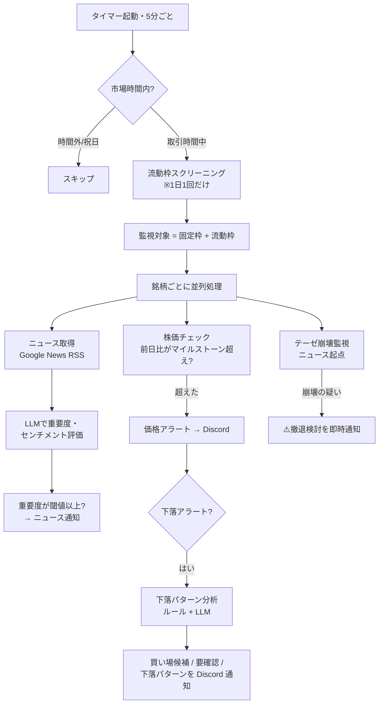
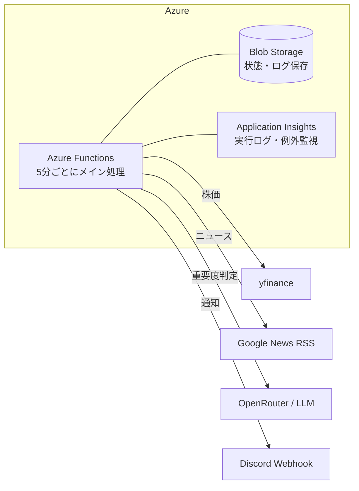

# stock-monitor とは

## ひとことで言うと

stock-monitor は、**「中長期で持つに値する優良企業が、その企業のせいではない理由で安く売られた瞬間」だけを自動で見つけ出し、人間が判断できる形に整えて差し出すシステム**です。

よくある株価アラートツールは「○円を割ったら通知」のように、値動きそのものに反応します。stock-monitor が狙っているのはそこではありません。狙うのは、**優良であること**と**安く売られていること**という二つが同時に成立する、稀な交点だけ。この一点に全機能が向いています。

5分ごとに東証銘柄の株価とニュースを見張り、下落を検知したら「これは買い場の歪みなのか、それとも掴んではいけない罠なのか」を AI（LLM）とルールの両方で判定し、Discord に通知します。動いているのは Azure 上の小さな Python プログラムです。

## なぜ「値動き」ではなく「歪み」を狙うのか

ここがこのシステムのいちばん大事な発想なので、先に丁寧に説明します。

株価は毎日上下します。下がる理由は大きく2つに分けられます。

1. **正当な下落** — その企業の実力が本当に落ちた。業績悪化、構造的な競争力の喪失など。これは「安くなった」のではなく「正しく評価された」だけ。掴めば損をします。
2. **理不尽な下落** — 企業の中身は何も変わっていないのに、地合いの悪化や他セクターへの資金移動、一時的なノイズで巻き添えを食って下がった。これは本来の価値より安く売られている＝**バーゲン（歪み）**。

この2つは、株価チャートを見ているだけでは区別がつきません。同じ「-9%」でも、片方は罠で片方はチャンスです。**この見分けを自動化することが、stock-monitor の核心**です。

## 土台になる7つの思想

機能の一つひとつは、次の7つの考え方から導かれています。ここを押さえると、なぜそういう作りになっているのかが腑に落ちます。

### 1. 中長期投資に特化する（デイトレはしない）

時間軸は「数ヶ月〜数年」。今日・今週の値動きで利益を確定する、という発想は一切持ち込みません。その結果として、**反応速度より判断の質を優先**します。1秒を争う約定スピードや板情報はこのシステムの関心事ではなく、むしろ「焦って動かないこと」を支援します。

### 2. 「優良株」とは “経済的な堀（Moat）” を持つ企業のこと

ここでの「優良」は、直近の業績が良いとか株価が上がっているという意味ではありません。**長期にわたって競争優位を守り続けられる構造的な強さ＝経済的な堀（Moat）** を持つ企業を指します。参入障壁、ブランド、寡占、スイッチングコストといった、一度の好決算では崩れない優位性のことです。

なぜこの定義が重要かというと、「下落の理不尽さ」という判定が、**堀の存在を暗黙の前提にしている**からです。堀のない企業が下げているなら、その下落はむしろ正当な評価かもしれない。堀があるからこそ、一時的な下落を「歪み（バーゲン）」と呼べます。

さらに最上位の堀として、**拡大していくマクロトレンドの「チョークポイント（不可欠な結節点）」を握る企業**を高く評価します。たとえば「AIデータセンター投資が今後巨大化する」という不可逆な需要があるとき、その建設に代替の効かない技術を独占する企業は、堀 × マクロの追い風が掛け算で効きます。ただしこの「成長性」は、株価の勢いやテーマの人気とは**断じて別物**です。質だけで測り、株価モメンタムでは決して測りません。

### 3. 「下落の理不尽さ」を自動判別する。ただし立証責任は買い場側にある

下落を検知すると、それが「業績悪化」なのか「連れ安」「資金流出」「一時的ノイズ」なのかを、データと LLM でパターン分類します。ただし、判定の重心は明確に**「罠を掴まないこと」**に置かれています。

最も避けたい失敗は、本物の業績悪化を「理不尽なバーゲン」と誤認して掴むこと。だから原則はこうです——

> **バーゲンだと積極的に立証されない限り、その下落は罠（＝見送り）とみなす。**

立証責任は常に「これは買い場だ」と主張する側にあります。材料の不在・情報不足・判断困難は、すべて「見送り」側に倒します。買い場を多少見逃すのは許容しますが、罠を買い場と偽って提示することは許容しません。

::: tip 具体例で見る「立証責任の境界線」
同じ「半導体セクターが軟調な中での -9%」でも、判定は正反対になります。

- **アドバンテスト（DeepSeekショック, 2025-01-27, -9.0%）** — AI設備投資の縮小懸念でテーマ全体が連れ安。アドバンテスト自身の受注・業績・契約には**新しい悪材料がない**。下落の原因はマクロテーマへの資金流出。→ **資金ローテーション＝買い場候補**として提示。
- **ルネサス（同じくセクター軟調, -9.0%）** — こちらは通期営業利益を-35%下方修正という、**個社固有の新しい悪材料がある**。→ **ファンダメンタル懸念**にとどめ、買い場としては提示しない。

分かれ目はただ一つ、「その銘柄に固有の受注・業績・契約に関する新情報があるか」。外部の地合い（セクター安）は「悪材料なし」を補強しますが、**個社固有の悪材料を打ち消す力は持ちません。**
:::

### 4. 出口の思想 — 「安く仕込む」と対になる「テーゼ崩壊時の撤退」

買いだけを語って売りを語らないシステムは片肺です。stock-monitor は「**仕込んだ理由（テーゼ）が崩れたら撤退する**」ことを柱の一つに据えています。

ここで言う出口は、短期的な利確・損切りのテクニックではありません。買いとまったく同じ物差し——「2. で定義した堀が実際に毀損したか」——で測ります。テーゼが生きている限りの株価下落は、むしろ買い増し局面であり、狼狽売りを抑止する方向に働きます。「株価が2倍3倍になったから売る」という発想は、このシステムでは**採らない**（それはデイトレの発想であり、思想1・4と正面衝突するため）。

「テーゼ崩壊監視」機能が、固定枠銘柄の投資テーゼとニュースを照合し、堀の構造的な毀損を判定します。判定は価格変動とは独立した**ニュース起点**で動きます（株価が動いていなくても堀の毀損は起こりうるため）。

### 5. 最終判断は、常に人間が下す

システムが担うのは「**歪みの発見と、判断材料の整理**」まで。「買う／買わない・売る／売らないの最終決定は必ず人間が下す」という境界を厳守します。自動売買・自動約定はこのシステムの射程外です。出力はあくまで「人間が最終判断を下すための、整理された一次情報」にとどめます。これは慎重さの表明であると同時に、責任の所在を明確にするための原則です。

### 6. 個人開発として続けられること（低認知負荷・低コスト）

すべては「個人が無理なく10年続けられる」ことが大前提です。

- **通知は絞る。** 「多くて見落とす」より「絞って必ず読む」を優先。ノイズを増やす機能追加には常に懐疑的。
- **監視は少数精鋭。** LLM の API コストを爆発させないため、対象は10〜30銘柄程度に絞り込む。
- **二段構え。** 「広範な数値スクリーニング（一瞬・安い）」で候補を絞り、「特定銘柄の LLM 評価（深い・やや高い）」で精査する。

「賢いが続けられない」より「素朴でも10年動き続ける」を選びます。

### 7. 完璧な設計を捨て、実戦データでロジックを締め上げる

相場の暴落パターンや LLM の挙動を、机上の設計だけで一発で当てるのは不可能です。だから初期の完璧主義は捨て、**デフォルトを最も安全な側（＝機会損失側）に倒した上で、あらゆる判定の軌跡を構造化ログ（JSONL）に残す**ことを最優先します。

実戦で起きた誤検知や見逃しは、後からログを分析して、閾値の変更やプロンプトの微修正で持続的にロジックを締めていく。ログは「10年動くシステムをデータ駆動で進化させるためのインフラ投資」と位置づけられています。

## システムの全体像

ここからは「実際にどう動いているか」です。

### 2つのウォッチリスト

監視対象は、性格の違う2つの枠の合算です。

| 枠 | 中身 | 選び方 |
| --- | --- | --- |
| **固定枠** | 人間が手で選んだ本命銘柄 | 思想2の「堀 × マクロの成長性」で人間が選定。投資テーゼ（撤退条件）も人間が記述 |
| **流動枠** | 日経225から日次で自動抽出した割安候補 | 「52週高値からの下落率・配当利回り・PBR」という数値だけで機械的に選定。成長性のような定性判断は持ち込まない |

固定枠は「質で選ぶ深い枠」、流動枠は「数値で広く拾う浅い枠」。役割をはっきり分けているのが思想6の二段構えの実装です。

### 5分ごとに動く処理の流れ

東証の取引時間中（平日 9:00〜15:30、昼休み・祝日・年末年始は除外）、5分おきに次の処理が走ります。

ポイントだけ拾うと——

- **ニュース評価は値動きと独立**して常に実行されます。株価が動いていなくても、堀を毀損するニュースは出るからです。
- **下落アラート時だけ**、追加で「下落パターン分析」が走ります。ここが思想3の本丸で、ルールベースの数値ガード（第一層）と LLM の定性判断（第二層）の二層で「これは罠か買い場か」を判定します。
- **引け後**（15:35〜15:40）には、日経225と全銘柄の終値・前日比をまとめた「引けサマリー」が1通届きます。

なお、土日・祝日は完全に停止するわけではありません。**ニュース専用モード**に切り替わり、1日3回（08:00 / 12:00 / 20:00 JST）ニュースを取得・評価してテーゼ崩壊監視だけを動かします。価格絡みの処理はすべて平日のみです。休日に拾った材料は営業日ベースのキャッシュに蓄積され、翌営業日の下落判定に文脈として引き継がれます。詳しくは[機能ガイド](./features.md)をご覧ください。

### 通知はチャンネルで切り分ける

Discord の通知は、性格ごとにチャンネルを分けています。「急変・買い場・サマリー」と「ニュース」を別チャンネルにすることで、ミュート設定を使い分けられ、思想6の「絞って必ず読む」を支えます。

| チャンネル | 届くもの |
| --- | --- |
| 価格 | 株価急変アラート、買い場候補、テーゼ崩壊の疑い、引けサマリー、流動枠の入れ替え |
| ニュース | 重要度スコア付きの IR・ニュース通知 |

### 動いている場所（インフラ）

個人開発・低コストを徹底するため、Azure の従量課金リソースだけで完結しています。アイドル時には課金が発生しません。

外部サービス（株価・ニュース・LLM・通知）はすべて Azure の外にあり、Function App からの HTTP 呼び出しでつながっています。重複通知を防ぐための「どこまで通知済みか」という状態は、ローカルでは `state.json`、本番では Blob Storage に自動で切り替えて保存します。

## このシステムが “あえてやらない” こと

最後に、何をしないかを明示しておきます。これらは技術的に可能でも、思想に反するので採用しません。

- **自動売買・自動約定はしない**（思想5：最終判断は人間）。
- **デイトレ的な短期売買の支援はしない**（思想1：時間軸は数ヶ月〜数年）。
- **株価が上がったから売る、という利確の示唆はしない**（思想4：撤退理由は堀の毀損だけ）。
- **株価モメンタムやテーマの人気で「成長株」を高値で追わない**（思想2：成長性は質だけで測る）。
- **通知を増やしてノイズを生む機能は足さない**（思想6：絞って必ず読む）。

---

要するに stock-monitor は、賢く速いトレーディングボットではありません。**焦らず、罠を避け、本物のバーゲンが来るまで静かに待ち続けるための「見張り役」**であり、引き金を引くのはいつでも人間です。
