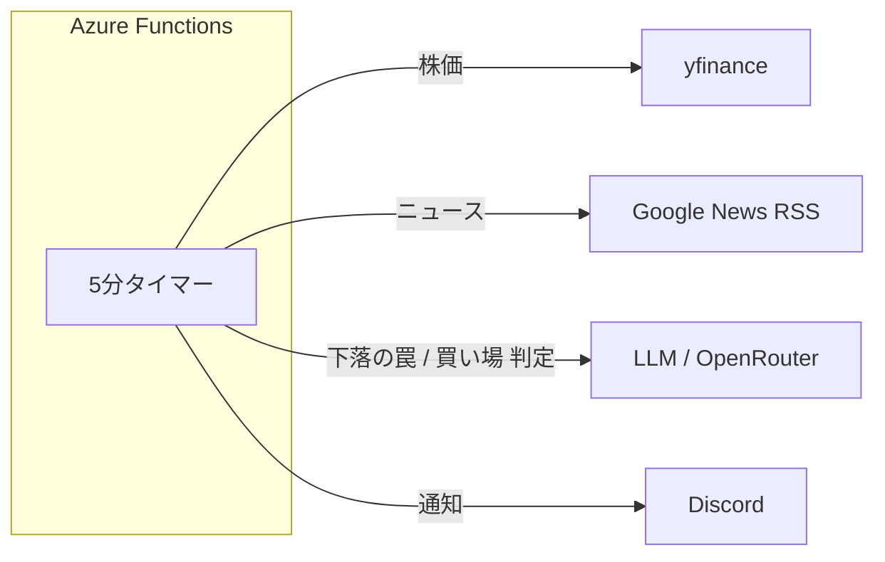
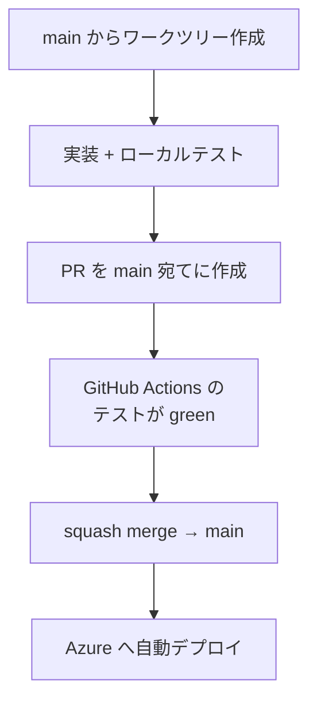
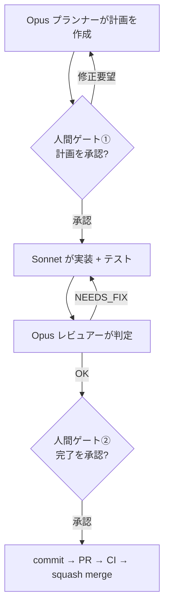

# 自律型エージェントで作ってみた

stock-monitor 開発の実例と、チームへの提案

Copilot の「補完」の、その先の話

---

## アジェンダ

1. **何を作ったか** — stock-monitor をざっと（本題ではないので手短に）
2. **どう作ったか** — Copilot の先、自律型エージェント開発
3. **チームへの提案** — 何が変わって、何がコストか
4. **まとめ** — まず何から始めるか

---

## 先に結論

> Copilot の「補完」で止まっていませんか？

個人開発で、**計画 → 実装 → テスト → PR まで Claude Code に回させて**、10年運用前提のシステムを1つ作りました。

- 人間の仕事は「**書く人**」から「**承認する人**」へ移った
- 丸投げではなく、**要所で人間が舵を握る**設計にしてある
- これを、Copilot だけの今のチームにも入れたい——という話をします

---

## そもそも何を作ったのか — stock-monitor

「理不尽に安く売られた優良株」を自動で狩るハンティングシステム

- 狙うのは**歪み（バーゲン）だけ** — 同じ「-9%」でも「**罠**」か「**買い場**」かを自動判別する
- 5分おきに株価・ニュースを取得し、下落を**ルール＋LLM の二層**で判定 → Discord に通知
- **最終判断は人間**が下す。自動売買・自動約定はしない

> アプリ自体の詳細は `intro` / `architecture` デッキへ。今日の本題は「**どう作ったか**」です

---

## 仕組みは1枚で

Azure 上の **5分タイマー1本**で全処理が完結するシンプルな構成

そして——**このコード、ほとんど自分でタイピングしていません**

---

## Copilot と自律型エージェントは何が違うのか

| 観点 | GitHub Copilot（補完中心） | 自律型エージェント（Claude Code） |
| --- | --- | --- |
| 作業単位 | 行・関数の**補完候補** | **issue 単位**でタスクを完遂 |
| コンテキスト | 開いているファイル周辺 | **リポジトリ全体を自分で探索** |
| 成果物 | コード片の提案 | **計画 → 差分 → テスト → PR** |
| 人間の役割 | タイピングを速くする | **レビューと意思決定** |

> ※ 最近は Copilot にも agent モードがありますが、ここでは「普段の補完中心の使い方」との対比です

---

## 開発フロー全体像 — トランクベース

- ブランチは **main 一本**（長生きする開発ブランチを作らない）
- マージで Azure に自動デプロイ。**短縮SHA** が刻まれ「本番で動いている正体」を常に追える

---

## 1人のAIに任せない — 役割分担

「**計画する人・書く人・チェックする人**」を分離する

| エージェント | モデル | 役割 | できないこと |
| --- | --- | --- | --- |
| 優先順位づけ役 | Opus | open issue を優先度順に並べ着手提案 | コード編集 |
| プランナー | Opus | issue を分析し実装計画を立てる | コード編集 |
| 実装担当 | Sonnet | 計画どおり実装し、テストで検証 | commit / push |
| レビュアー | Opus | 整合・ドキュメント同期を確認し可否判定 | コード編集 |

> 役割ごとに「**できないこと**」を課すことで、1人が暴走して計画から逸れるのを防ぐ

---

## 人間が舵を握る — 2つの関所

- **丸投げではない**。計画に入る前と、マージ前に人間が承認する
- レビュアーの差し戻し（NEEDS_FIX）が2回続いたら、**計画ごと人間に相談**

---

## エージェントに「規律」を持たせる

品質は、プロンプトの善意ではなく**仕組み**で守る

| テスト | 何を確かめる | 外部通信 |
| --- | --- | --- |
| `test_unit.py` | ロジックの正確性 | **禁止**（すべてモック） |
| `test_local.py` | 外部サービスとの疎通 | **必須** |
| `test_backtest.py` | 下落判定の回帰 | `--llm` 時のみ |

- **false green 防止**: テスト0件なら異常終了＋CI でも「PASS が1件以上」を確認
- **番兵パターン**: 実通信する関数をモックし忘れたら、その瞬間にエラーで爆発させる

---

## 並列で回す・プロセスを資産にする

**並列** — worktree 並走で複数 issue を同時着手

- それぞれが独立した作業ブランチを持ち、実装・テストを並列で進める
- 衝突判定は「同じファイルの同じ箇所を触るか」単位（`docs/` を触れば全部衝突、とはしない）

**資産化** — 開発プロセスを**スキル**にして繰り返し使う

- `/agent-resolve`（マルチエージェントで issue 解決）、`/release`、`/check-consistency` …
- 一度作った「型」は、チームで何度でも再利用できる

---

## 開発体験はどう変わるか

| | Copilot 中心 | 自律型エージェント中心 |
| --- | --- | --- |
| 実装 | 人間が書く（補完で加速） | **退屈な実装はエージェントに委譲** |
| 人間の主作業 | コーディング | **計画レビューと意思決定** |
| 品質 | 人のレビュー頼み | **テスト・ガードを仕組みで強制** |
| 属人性 | 書ける人に依存 | **手順がスキルとして共有資産に** |

「**書く時間**」を「**考える時間**」に振り替えられる

---

## いいことばかりではない（正直に）

導入を考えるなら、コストも先に共有しておきます

- **Opus 枠を消費する** — プランナー・レビュアーが枠を食う。並列を増やすほど先に詰まる
- **レビューは依然として人間の仕事** — 承認・差し戻しは自動化できない（し、すべきでない）
- **学習コスト** — プロンプトと「役割分担・人間ゲート」というプロセス設計に慣れが要る
- **API 課金** — 補完より重い。タスクを丸ごと回すぶんトークンも増える

> それでも、「書く時間」を「考える時間」に振り替えられる価値が上回る、というのが個人開発での結論

---

## どう始めるか — 段階導入

いきなりフル構成にしない。**Copilot と併用**でいい

1. **小さく試す** — 各自、1 issue を Claude Code に解かせてみる
2. **型にする** — うまくいった手順をスキル化して、チームで共有する
3. **広げる** — worktree 並走をチームの開発フローに組み込む

> ①で手応えを掴めれば、②③は自然に乗っていけます

---

## まとめ

- stock-monitor は「**ほぼエージェント実装**」で、10年運用前提の品質に到達した
- 鍵は3つ — **役割分担 × 人間ゲート × 仕組みで守る品質**
- Copilot の補完は便利。でも、**その先**にタスクを丸ごと任せる世界がある

> **まず1人1 issue、来週やってみませんか？**

