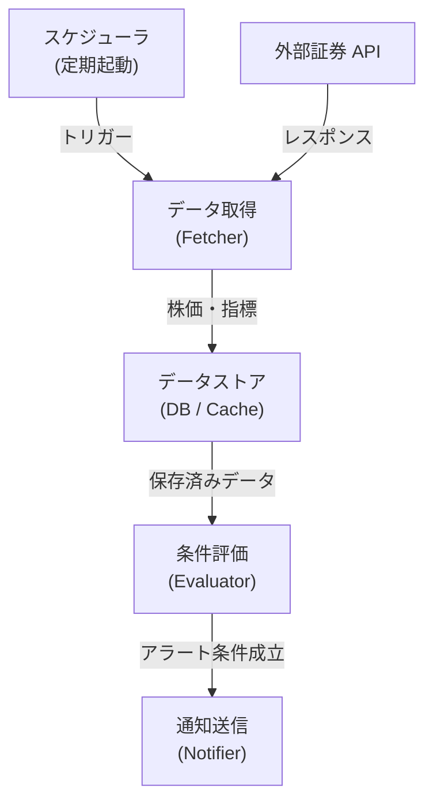

# システム構成

stock-monitor のコンポーネント構成と処理フローを説明します。

---

## コンポーネント全体像

---

## 処理フロー詳細

1. **スケジューラ** が設定間隔で Fetcher を起動
2. **Fetcher** が外部証券 API を叩き、株価・指標データを取得してストアに保存
3. **Evaluator** がストアのデータに対して監視ルールを評価
4. 条件が成立したら **Notifier** が Slack / Webhook 等へ通知を送信

---

## スケーリング方針

- 取得対象銘柄の増加 → Fetcher を水平スケール（並列取得）
- ルール評価の高頻度化 → Evaluator をキューベースに切り出し
- 通知先の追加 → Notifier をプラグイン方式で拡張

---

## まとめ

各コンポーネントが**疎結合**で設計されているため、取得・評価・通知それぞれを独立して差し替え・スケールアップできます。
