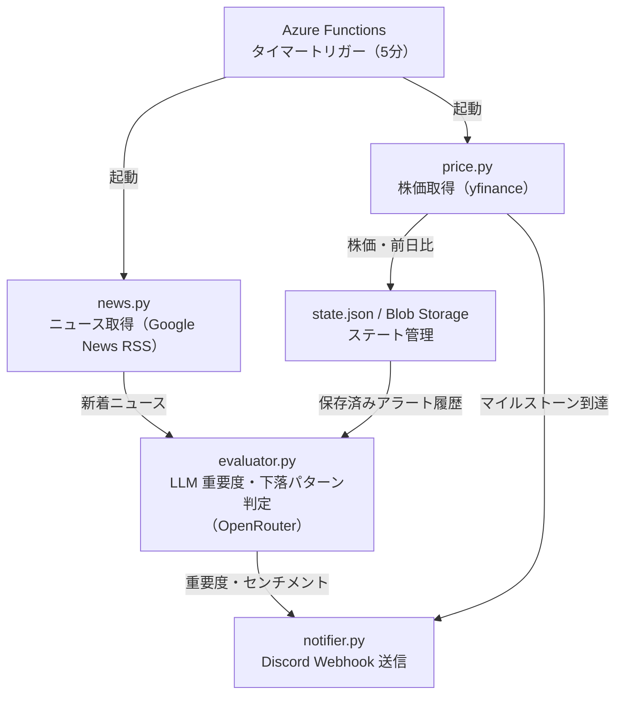

# システム構成

stock-monitor のコンポーネント構成と処理フローを説明します。

---

## コンポーネント全体像

---

## 処理フロー詳細

1. **Azure Functions タイマートリガー**（5分間隔）が起動
2. **price.py** が yfinance から株価を取得し、前日比がマイルストーン（閾値の倍数）を超えたら即時アラート
3. **news.py** が Google News RSS を検索し新着記事を抽出
4. **evaluator.py** が OpenRouter へ記事内容を投げ、重要度（1〜10）・センチメント・下落パターンを LLM 判定
5. 条件成立時は **notifier.py** が Discord Webhook（株価用 / ニュース用）へ送信

---

## 並列処理の仕組み

- 銘柄ごとの処理は `_concurrent.py`（`ThreadPoolExecutor` ラッパー）で並列実行
- 同時実行数は `config.json` の `max_parallel_stocks` で調整
- ステート（送信済みGUID・アラート日）は `state.py` が管理し、5分ごとの重複通知を防止

---

## まとめ

Azure Functions の単一タイマートリガーで完結するシンプルな構成です。銘柄数のスケールは `max_parallel_stocks` の調整で対応できます。
