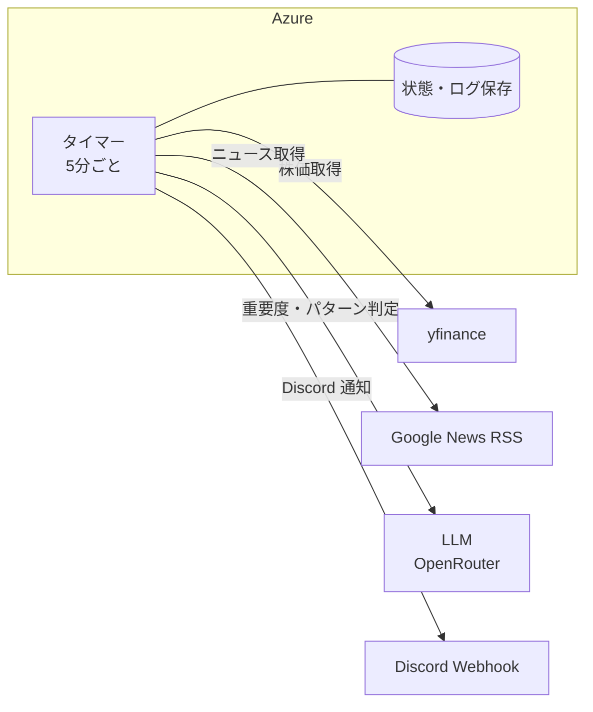
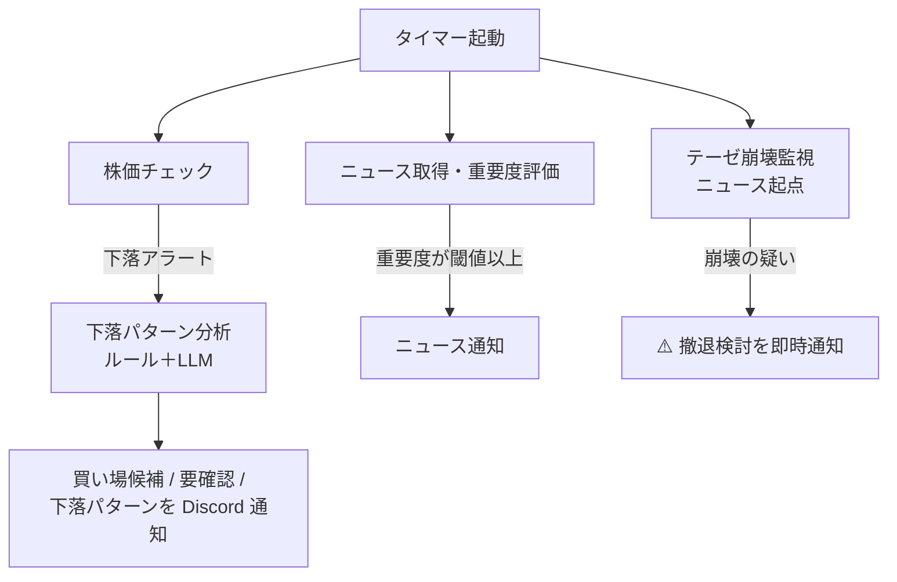

# システム構成

stock-monitor がどう動いているか——コンポーネントと処理フローを解説します

---

## コンポーネント全体像

Azure Functions の単一タイマートリガーで完結するシンプルな構成

---

## 5分ごとの処理フロー

---

## 株価監視——マイルストーン型アラート

- 前日比が閾値の倍数（マイルストーン）を超えるたびに追加アラート
- 同じ段階への再通知は防止。日付をまたいでリセット
- **glitch ガード**: 前日比 30% 超・サイクル間 15% 超の異常値を除外

---

## 下落パターン分析——二層判定

**第一層（ルールベース）で確定できない場合のみ LLM へ**

| 第一層で確定するパターン | 条件 |
| --- | --- |
| ファンダメンタル懸念 | 高重要度の悪材料 ＋ 高出来高 |
| 市場全体の下落 | 日経225との連動範囲内 |
| ノイズ | 出来高・ニュースともに薄い |

第二層（LLM）では残りの4パターンを定性判断

---

## 出力ガード——安全弁の多重化

LLM の判定にも4つの安全弁

| ガード | 働き |
| --- | --- |
| クラッシュガード | 大暴落 × 好材料なし → 見送り |
| 内生キル | 原油安 × 石油業種 → 見送り |
| 資金ローテーション保留 | 現在は観測フェーズのため通知抑制 |
| 情報真空ガード | ニュース 0 件 → 見送り |

判断できない・立証できないは、すべて「見送り」側に倒す

---

## インフラ——低コストで10年動き続ける

- **Azure Functions** — 従量課金。アイドル時は課金ゼロ
- **Blob Storage** — 状態・構造化ログ（JSONL）の永続化
- **Application Insights** — 実行ログ・例外監視
- 外部サービス（株価・ニュース・LLM・通知）はすべて HTTP で連携

「賢いが続けられない」より「素朴でも10年動き続ける」

---

## まとめ

- Azure 上の **5分タイマー1本**で全処理が完結
- **ルール＋LLM の二層**で「罠か買い場か」を判定
- 状態・ログを Blob に保存し、チューニングのデータ源に
- 最終判断は人間が下す
